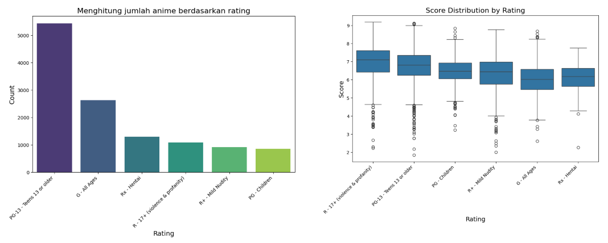

# Laporan Proyek Machine Learning - Aryaputra Maheswara

---

## Project Overview

---

Anime merupakan salah satu bentuk hiburan yang sangat populer di berbagai kalangan, baik anak-anak, remaja, maupun dewasa. Sebagai medium seni visual yang menggabungkan cerita mendalam, visual yang menawan, dan musik yang memikat, anime memiliki daya tarik yang kuat bagi para penggemarnya. Namun, seiring dengan pertumbuhan industri anime, jumlah judul yang tersedia di berbagai platform semakin meningkat, menciptakan tantangan bagi pengguna dalam menemukan anime yang sesuai dengan preferensi mereka.

Rekomendasi anime menjadi solusi untuk membantu pengguna menemukan anime yang relevan dengan minat mereka. Teknologi modern, seperti sistem rekomendasi berbasis kecerdasan buatan, memungkinkan pengalaman yang lebih personal dalam memilih anime. Salah satu metode yang dapat digunakan adalah content-based filtering, yang memanfaatkan data dari fitur atau karakteristik anime untuk menemukan kesamaan antara satu anime dengan yang lain.

**Mengapa Proyek Ini Perlu Diselesaikan?**
Mengapa Proyek Ini Perlu Diselesaikan?
1. Pertumbuhan Industri Anime: Ukuran pasar global anime diperkirakan mencapai USD 31,23 miliar pada tahun 2023 dan diproyeksikan tumbuh dengan laju tahunan gabungan (CAGR) sebesar 9,8% dari tahun 2024 hingga 2030. Permintaan yang terus meningkat terhadap konten anime Jepang, distribusi berbasis internet, serta aplikasi game menjadi pendorong utama ekspansi pasar ini [Anime Market Size, Share, Growth And Trends Report, 2024](https://www.who.int/news-room/fact-sheets/detail/diabetes) [1].
2. Kepuasan Pengguna: Pengalaman pengguna sangat dipengaruhi oleh relevansi konten yang direkomendasikan. Studi menunjukkan bahwa algoritma berbasis konten dapat meningkatkan personalisasi dan kepuasan pengguna [2].
3. Efisiensi dalam Penemuan Konten: Tanpa sistem rekomendasi yang efisien, pengguna sering kali menghabiskan waktu yang lama untuk mencari anime yang mereka sukai, yang dapat menurunkan tingkat keterlibatan mereka [3].
4. Pemanfaatan Data yang Tersedia: Data deskriptif seperti genre, deskripsi, dan karakteristik anime lainnya dapat dimanfaatkan untuk menghasilkan rekomendasi yang akurat [4].

## Business Understanding

---

### Problem Statement
* Apa genre anime yang paling populer di seluruh kalangan?
* Anime apa yang paling populer dan disukai di dalam data tersebut?
* Apakah ada hubungan antar variabel pada dataset yang data diintepretasikan?
* Bagaimana cara membuat sistem rekomendasi anime?

### Goals
* Mengetahui genre anime yang paling populer serta mencari hubungan antar variabel yang berkaitan dengan anime
* Membuat sistem rekomendasi yang dapat merekomendasikan anime yang relevan
* Menggunakan algoritma cosine similarity untuk membuat sistem rekomendasi, lalu mengevaluasi menggunakan metriks precission untuk menjamin keakuratan sistem rekomendasi.

### Solution Approach
* Mengimplementasikan Exploratory Data Analysis (EDA) untuk analisis dan visualisasi data.
* Mengimplementasikan content-based filtering approach menggunakan algoritma cosine similarity.

## Data Understanding

---

Dataset yang digunakan adalah data Anime yang tersedia pada website kaggle yang dapat di akses pada link [Berikut ini](https://www.kaggle.com/datasets/iammustafatz/diabetes-prediction-dataset), dataset ini berisi data Anime yang di scarping pada website MyAnimeList di tahun 2020 dengan jumlah baris dan kolom sebanyak 17562 baris dan 35 kolom untuk anime.csv dan 16214 baris dan 5 kolom untuk anime_with_synopsis.csv.

    

    

### Keterangan Variabel
Dataset anime.csv berisi memiliki 35 variabel dengan keterangan sebagai berikut :

#### anime.csv

| Variabel | Keterangan |
|----------|------------|
| MAL_ID |  ID Anime yang tersimpan pada MyAnimeList (e.g. 1)|
| Name | Nama lengkap dari anime |
| Score | Rata-rata skor anime yang diberikan oleh user MyAnimeList. (e.g 8,78) |
| Genres | List dari genre yang ada pada 1 judul anime yang dipisahkan oleh koma (e.g Action, Comedy, Drama) |
| English name | Judul anime dalam bahasa inggris |
| Japanese name | Judul anime dalam bahasa Jepang |
| Type | Tipe anime (e.g TV, Movie, OVA) |
| Episodes | Jumlah episode |
| Aired | Tanggal Penayangan (e.g. Apr 3, 1998 to Apr 24, 1999) |
| Premiered | Musim tayang (e.g Spring 1998) |
| Produces | List dari produser anime |
| Licensors | List dari pemberi lisensi anime |
| Studios | List dari studio anime |
| Source | Sumber dari anime (e.g Manga) |
| Duration | Durasi anime per episode (e.g 24 min. per ep.) |
| Rating | Rating umur (e.g. R - 17+ (violence & profanity)) |
| Ranked | Posisi anime berdasarkan skor |
| Popularity | Posisi berdasarkan jumlah user yang menyimpan anime ke dalam list mereka |
| Members | Jumlah member komunitas yang ada pada grup anime ini |
| Favorites | Jumlah user yang menandai anime sebagai favorite |
| Watching | Jumlah user yang sedang menonton anime |
| Completed | Jumlah user yang telah menamatkan anime |
| On-Hold | Jumlah user yang menunda menonton anime) |
| Dropped | Jumlah user yang tidak melanjutkan menonton anime |
| Plan to Watch | Jumlah user yang berencana menonton anime |
| Score-10 | Jumlah user yang memberikan skor 10 |
| Score-9 | Jumlah user yang memberikan skor 9 |
| Score-8 | Jumlah user yang memberikan skor 8 |
| Score-7 | Jumlah user yang memberikan skor 7 |
| Score-6 | Jumlah user yang memberikan skor 6 |
| Score-5 | Jumlah user yang memberikan skor 5 |
| Score-4 | Jumlah user yang memberikan skor 4 |
| Score-3 | Jumlah user yang memberikan skor 3 |
| Score-2 | Jumlah user yang memberikan skor 2 |
| Score-1 | Jumlah user yang memberikan skor 1 |
 
#### anime_with_synopsis.csv

Dataset anime_with_synopsis.csv berisi memiliki 5 variabel dengan keterangan sebagai berikut :

| Variabel | Keterangan |
|----------|------------|
| MAL_ID |  ID Anime yang tersimpan pada MyAnimeList (e.g. 1)|
| Name | Nama lengkap dari anime |
| Score | Rata-rata skor anime yang diberikan oleh user MyAnimeList. (e.g 8,78) |
| Genres | List dari genre yang ada pada 1 judul anime yang dipisahkan oleh koma (e.g Action, Comedy, Drama) |
| sypnopsis | Sinopsis dari anime |

### Statistik Data

Berikut adalah data statistik numerikal secara umum
| | MAL_ID | Popularity |	Members |	Favorites | Watching | 	Completed | On-Hold | 	Dropped | 	Plan to Watch | 
|----------|----------|------------|------------|------------|------------|------------|------------|------------|------------|
| count |  17562.000000 |	17562.000000 |	1.756200e+04 |	17562.000000 |	17562.000000 |	1.756200e+04 |	17562.000000 |    17562.000000 |	17562.000000 |
| mean |	21477.192347 |	8763.452340 |	3.465854e+04 |	457.746270 |	2231.487758 |	2.209557e+04 |	955.049653 |	1176.599533 |	8199.831227 |
| std |	14900.093170 | 	5059.327278 |	1.252821e+05 |	4063.473313 |	14046.688133 |	9.100919e+04 |	4275.675096 |	4740.348653 |	23777.691963 |
| min |	1.000000 |	0.000000 |	1.000000e+00 |	0.000000 |	0.000000 |	0.000000e+00 |	0.000000 |	0.000000 |	1.000000
|25% | 5953.500000 |	4383.500000 |	3.360000e+02 |	0.000000 |	13.000000 |	1.110000e+02 |	6.000000 |	37.000000 |	112.000000 |
| 50% |	22820.000000 |	8762.500000 |	2.065000e+03 |	3.000000 |	73.000000 |	8.175000e+02 |	45.000000 |	77.000000 |	752.500000 |
| 75% |	35624.750000 |	13145.000000 |	1.322325e+04 |	31.000000 |	522.000000 |	6.478000e+03 |	291.750000 |	271.000000 |	4135.500000 |
| max |	48492.000000 |	17565.000000 |	2.589552e+06 | 	183914.000000 |	887333.000000 |	2.182587e+06 |	187919.000000 |	174710.000000 |	425531.000000 |

## Exploratory Data Analysis
---

### Top 10 Anime Paling Populer

### Top 10 Anime Paling Disukai

**Insights yang Dapat Diperoleh**
* Korelasi Popularitas dengan Favorites:

    Anime dengan nilai Favorites tinggi kemungkinan besar memiliki nilai Popularity kecil (sangat populer).
* Identifikasi Anime Ikonik:

    Anime dengan Favorites tertinggi biasanya dianggap ikonik atau memiliki komunitas penggemar yang besar.
---

### Analisis Rating

Gambar diatas dapat di diinterpretasikan sebagai berikut.

* Rating dengan jumlah tertinggi adalah PG-13 dengan jumlah sebanyak 5435
* Score anime dengan rata - rata paling tinggi adalah anime dengan rating R-17+ dengan rata - rata 7.2, artinya anime dengan rating R lebih disukai
* Anime dengan score rata - rata yang paling kecil adalah anime dengan rating G - All Ages
* Anime dengan rating PG-13 memiliki penyebaran rating yang paling banyak, artinya anime dengan rating PG-13 memiliki perbedaan kualitas

### Analisis Genre

Gambar diatas dapat di diinterpretasikan sebagai berikut.
* Jumlah genre unik ada 83 genre
* Anime dengan genre komedi merupakan anime dengan jumlah yang paling banyak, yaitu 6029 anime
* Anime dengan genre harem memiliki rata - rata popularitas yang paling tinggi meskipun memiliki jumlah anime yang lebih sedikit dari yang lainnya dengan jumlah sebanyak 399 anime
* Sedangkan anime dengan genre Kids memiliki rata - rata popularitas yang paling kecil

### Distribusi tipe anime

Gambar diatas dapat di diinterpretasikan sebagai berikut.
* Terdapat 6 tipe anime, yaitu TV, OVA, Movie, Special, ONA, Music
* Anime dengan tipe TV memiliki jumlah yang paling banyak, sebanyak 3761 anime

## Data Preparation

Sebelum diproses, data akan diperiksa terlebih dahulu apakah terdapat data null ataupun data duplikat.

* Mengecek Value kosong dengan **data_anime.isna_sum() dan data_anime.duplicated().sum()**
tidak ditemukan data kosong ataupun duplikat

* Mengecek kolom dengan value 'Unknown' dengan **data_anime.apply(lambda col: col.isin(['Unknown']).sum())**
 output

    | Kolom | Jumlah |
    |----------|----------|
    | MAL_ID | 0 |
    | Name  | 0 |
    | Score | 5141 |
    | Type | 37 |
    | Episodes | 516 |
    | Rating | 688 |
    | Genres | 63 |

* Drop kolom dengan value 'Unknown' dengan **data_anime_cleaned = data_anime.loc[~data_anime.isin(['Unknown']).any(axis=1)]**

* Mengecek apakah ada data null di anime_sinopsis dengan **anime_sinopsis.isna().sum()**
  Ditemukan 8 data kosong pada kolom sypnopsis

* Melakukan pengecekan apakah ada data Unknown di anime_sinopsis

Drop kolom bernilai null, tetapi tidak dengan Unknown, karena hanya data sinopsis yang dibutuhkan

* Merge dataframe data_anime_cleaned dengan dataframe sinopsis, kita akan mengekstrak kolom sinopsis pada dataframe anime_sinopsis dengan menggunakan MAL_ID kemudian di merge ke dalam dataframe data_anime_cleaned
    
    
* Selanjutnya digunakan tfidfvectorizer() pada data genre dan sinopsis, kemudian kedua matrix tersebut dikombinasikan menjadi 1 matriks.  Lalu, dibentuk dataframe yang berisi genre dan sinopsis anime yang telah dilakukan vektorisasi dengan TfidfVectorizer() sebagai kolom dan seluruh judul anime sebagai barisnya. Contoh dari dataframe dapat dilihat pada tabel berikut.

## Modelling

 Sistem rekomendasi content-based filtering dengan menggunakan cosine similarity sebagai algoritma untuk menghitung kesamaan antara item-item yang ada. Cosine similarity mengukur sejauh mana dua vektor memiliki arah yang sama. Algoritma ini sangat berguna untuk menghitung kesamaan antara representasi konten (seperti fitur TF-IDF atau embedding) dari item dalam dataset.

    

Cosine similarity memiliki beberapa kelebihan, seperti output yang ternormalisasi antara -1 hingga 1, sehingga memudahkan interpretasi kesamaan antar item, serta kemudahan implementasi dan efisiensi pada data sparse berdimensi tinggi. Namun, kelemahannya termasuk anggapan bahwa semua fitur memiliki bobot yang sama, tanpa mempertimbangkan relevansi atau pentingnya fitur tertentu. Selain itu, algoritma ini sensitif terhadap perubahan kecil dalam sudut vektor, yang bisa memengaruhi hasil secara signifikan, dan kurang cocok untuk data yang mengandung nilai negatif, seperti rating atau data numerik dengan rentang negatif. Setelah dibentuk sistem rekomendasi, selanjutnya akan diuji sistem rekomendasi ini untuk menampilkan top 10 rekomendasi berdasarkan anime yang dipilih oleh user. Diperoleh hasil berikut.

## Evaluasi

Pada proyek ini, metrik evaluasi yang digunakan adalah precision. Precision mengukur seberapa akurat rekomendasi yang diberikan oleh sistem, yaitu proporsi dari item yang direkomendasikan yang benar-benar relevan. Dalam konteks sistem rekomendasi berbasis konten untuk anime, precision menunjukkan seberapa banyak anime yang direkomendasikan kepada pengguna yang sesuai dengan preferensi atau minat mereka.

Formula precision dapat dijelaskan sebagai berikut:

    

 contoh: Jika dari 10 rekomendasi, 6 relevan, maka precision adalah 0.6.
 Nilai cosine similarity akan digunakan untuk menentukan apakah suatu item relevan atau tidak, jika nilai cosine similarity diatas 0.5 maka item dianggap relevan.

### Hasil Akhir

Dari data diatas didapatkan rata - rata nilai precission adalah 0.86 yang bisa dibilang cukup bagus, namun nilai tersebut akan berubah-ubah tergantung dengan preferensi dari user.

## Kesimpulan
---

1. Genre komedi merupakan genre yang paling favorit di kalangan penggemar anime, dibuktikan dengan memiliki jumlah anime terbanyak yaitu 6029 anime, meskipun genre ini memiliki variasi popularitas yang lebih rendah dibandingkan genre lainnya.
2. Anime Fullmetal Alchemist: Brotherhood merupakan anime paling ikonik di kalangan penggemar, dibuktikan dengan memiliki nilai Favorites tertinggi, meskipun anime Death Note lebih populer di tahun 2020.

3. Terdapat beberapa variabel yang berkorelasi, yaitu sebagai berikut:

    * Variabel genre dan popularitas:

        * Genre harem berkorelasi positif yang cukup kuat terhadap popularitas. Meskipun memiliki jumlah anime yang lebih sedikit (399 anime), anime dengan genre ini memiliki rata-rata popularitas yang lebih tinggi, menunjukkan bahwa genre ini lebih disukai oleh kalangan tertentu.
        
        * Sebaliknya, genre kids berkorelasi negatif dengan popularitas karena anime dengan genre ini memiliki rata-rata popularitas yang lebih rendah dibandingkan genre lainnya.
    * Variabel rating dan skor:

        * Variabel rating berkorelasi positif yang kuat terhadap score anime. Anime dengan rating R-17+ memiliki rata-rata skor tertinggi (7.2), menunjukkan bahwa anime dengan rating ini lebih disukai dan mendapatkan lebih banyak apresiasi.
        * Sebaliknya, anime dengan rating G - All Ages berkorelasi negatif dengan skor, karena anime dengan rating ini memiliki rata-rata skor yang lebih rendah, menandakan bahwa anime untuk semua usia cenderung kurang disukai secara umum.
    * Variabel tipe anime dan jumlah anime:

        * Tipe anime TV berkorelasi positif dengan jumlah anime terbanyak (3761 anime), menandakan bahwa format serial televisi menjadi pilihan utama dalam produksi anime.

4. Sistem rekomendasi anime dapat diimplementasikan dengan menggunakan pendekatan Content-based filtering menggunakan cosine similarity untuk memberikan rekomendasi berdasarkan preferensi pengguna.

### Referensi
[1] Grand View Research, "Anime Market Size, Share & Trends Analysis Report By Type (T.V., Movie, Video, Internet Distribution), By Genre, By Demographics, By Region, And Segment Forecasts, 2024 - 2030," 2023. [Online]. Available: https://www.grandviewresearch.com/industry-analysis/anime-market.

[2] R. Burke, "Hybrid recommender systems: Survey and experiments," User Modeling and User-Adapted Interaction, vol. 12, no. 4, pp. 331–370, Nov. 2002, doi: 10.1023/A:1021240730564.

[3] M. Pazzani and D. Billsus, "Content-based recommendation systems," in The Adaptive Web: Methods and Strategies of Web Personalization, Berlin, Heidelberg: Springer, 2007, pp. 325–341, doi: 10.1007/978-3-540-72079-9_10.

[4] X. Su and T. M. Khoshgoftaar, "A survey of collaborative filtering techniques," Advances in Artificial Intelligence, vol. 2009, pp. 1–19, 2009, doi: 10.1155/2009/421425.